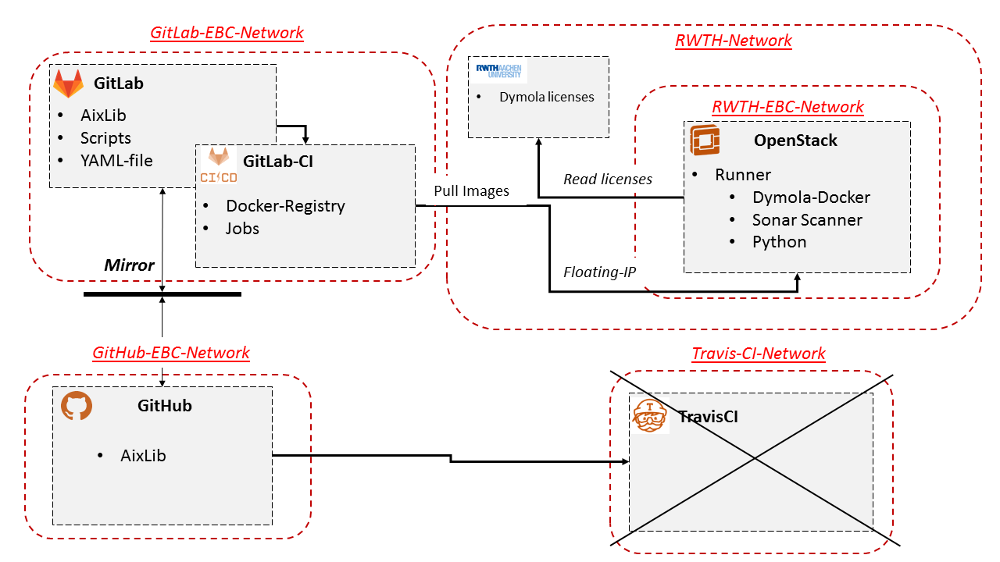

# Here are the basics to setup a gitlab runner on [linux](https://docs.gitlab.com/runner/install/linux-repository.html)

First you have to create a new instance on [openstack](https://ecampus.rwth-aachen.de/units/eonerc/ebc/Wiki/OpenStack%20Einstieg.aspx). 
It is important that you assign a floating IP to the instance, because the CI will later work with this IP.
Then log in to your created instance and do the following points. 

### Add GitLab´s official repository
	
	curl -L https://packages.gitlab.com/install/repositories/runner/gitlab-runner/script.deb.sh | sudo bash

### Install the latest version of GitLab Runner

	sudo apt-get install gitlab-runner
	
### To install a specific version of GitLab Runner:
		
	apt-cache madison gitlab-runner
	sudo apt-get install gitlab-runner=10.0.0
	

### [Register](https://docs.gitlab.com/runner/register/index.html) the Runner: To register a Runner under GNU/Linux:
	
	1. Run the following command:
	
		sudo gitlab-runner register
		
	2. Enter your GitLab instance URL: (General -> CI/CD -> Runners)
	
		Please enter the gitlab-ci coordinator URL (e.g. https://gitlab.com 
		xxx
		
	3. Enter the token you obtained to register the Runner
	
		Please enter the gitlab-ci token for this runner
		xxx
	
	4. Enter a description for the Runner, you can change this later in GitLab’s UI:
	
		Please enter the gitlab-ci description for this runner
		[hostname] my-runner
		
	5. Enter the tags associated with the Runner, you can change this later in GitLab’s UI:
	
		Please enter the gitlab-ci tags for this runner (comma separated):
		my-tag,another-tag
		
	6. Enter the Runner executor:
		Please enter the executor: ssh, docker+machine, docker-ssh+machine, kubernetes, docker, parallels, virtualbox, docker-ssh, shell:
		docker

	7. If you chose Docker as your executor, you’ll be asked for the default image to be used for projects that do not define one in .gitlab-ci.yml:
		Please enter the Docker image (eg. ruby:2.6):
		ubuntu:18.04
		

### Start the GitLab Runner service.

	gitlab-runner start